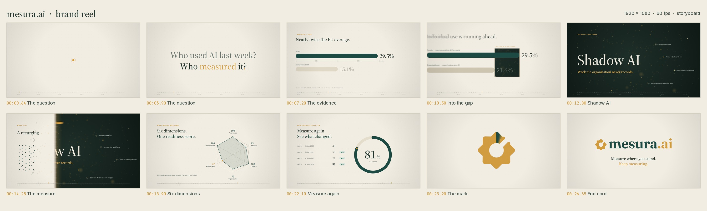
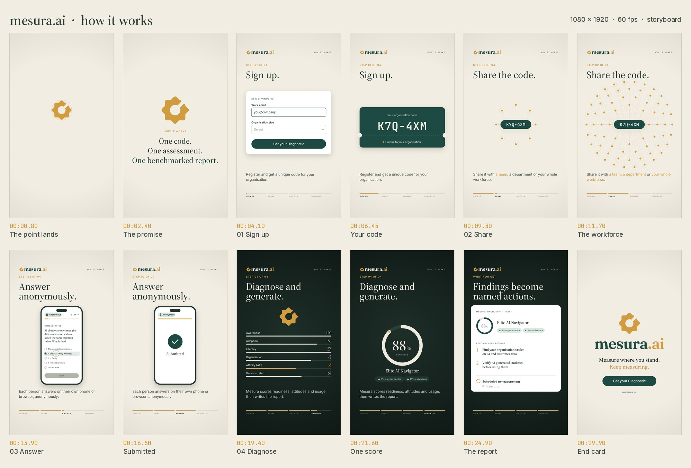

# Mesura.ai films

Two motion pieces for Mesura.ai, built in code on one shared engine:

1. **Brand reel.** 26 seconds, 1920×1080, about what Mesura is for.
2. **How it works.** 30 seconds, 1080×1920 for phones, about how the diagnostic runs.

Every frame is a pure function of time. The same composition runs live in a browser and
renders offline with real motion blur. Each soundtrack is synthesised from the animation's
own event sheet, so picture and sound can't drift.

## 1. Brand reel (16:9)

**Watch:** [`mesura-reel.mp4`](mesura-reel.mp4) (26.4 s, H.264 High, BT.709, 60 fps, AAC 256 kb/s, 13 MB).



One ochre point runs through the whole piece. It starts as the dot of a question mark and
ends as the full stop in *mesura.ai*.

| Time | Beat | What happens |
| --- | --- | --- |
| 0.0 – 4.2 | **The question** | We start inside the dot and pull out. It lands on the beat with a sonar ping, then sweeps the baseline while *Who used AI last week?* springs up behind it. It docks as the dot of each `?`, and the second line is *Who measured it?* |
| 4.2 – 10.2 | **The evidence** | The dot stretches into Malta's bar, and a mechanical odometer counts to **29.5%**. The EU bar reaches **15.1%**. A dimension line lays off the EU length twice to show *nearly twice*. The comparison then flips to organisations (**21.6%**) and the gap between the bars is hatched as *the space in between*. |
| 10.2 – 13.8 | **Shadow AI** | The camera dives into the gap, which works as a portal onto a dark world of drifting, out-of-focus points. *Shadow AI* racks into focus, with annotations: unapproved tools, unrecorded workflows, outputs nobody verified. |
| 13.8 – 16.2 | **The measure** | A ruler edge sweeps the frame. Dark becomes paper, and every drifting point snaps into an ordered grid of respondents. *A recurring measurement system.* |
| 16.2 – 19.7 | **Six dimensions** | The grid pours into a radar that tilts up to face the camera. The six dimensions count up to their scores, and the one focus area is marked in ochre. |
| 19.7 – 22.8 | **Measure again** | The radar collapses into a progress ring. Four takes follow (43 → 59 → 71 → 81), each with its delta badge. The head of the arc is the ochre point. |
| 22.8 – 26.4 | **The mark** | The ring's gap swings round to 45°, ochre floods back from the head, and the ring grows into the Mesura mark (the mark's slot *is* the ring's gap). The point is flung out through the slot and lands as the full stop in *mesura.ai*. *Measure where you stand. Keep measuring.* |

## 2. How it works (9:16)

**Watch:** [`mesura-how-it-works.mp4`](mesura-how-it-works.mp4) (30 s, 1080×1920, H.264 High, BT.709, 60 fps, AAC 256 kb/s, 11 MB).



The four steps from the Chamber deck, told on a phone-shaped canvas. The ochre point is
again the thread: it drops in and becomes the mark, the mark becomes the engine that
digests every answer, and the engine unfolds into the readiness score.

| Time | Beat | What happens |
| --- | --- | --- |
| 0.0 – 3.0 | **The promise** | The point falls in under gravity, lands with a sonar ping and grows into the Mesura mark. *One code. One assessment. One benchmarked report.* The mark flies up into the header lockup and the wordmark wipes on beside it. |
| 3.0 – 7.8 | **01 Sign up** | A sign-up card springs up. A work email types itself, a size is picked and a finger taps *Get your Diagnostic*. The tap floods the card with pine, the card becomes a ticket, and the organisation code decodes one character at a time. |
| 7.8 – 12.6 | **02 Share the code** | The ticket shrinks to a pill. The code travels out to a team, a department, then the whole workforce (8, 14 and 46 people), and each phrase in the caption lights up as the code arrives. |
| 12.6 – 17.4 | **03 Answer anonymously** | One person's dot grows into their phone. They pick an answer and tap *Next*, the other eight questions flick past, and the survey is submitted anonymously. Back in the rings, everyone else finishes too. |
| 17.4 – 22.2 | **04 Diagnose and generate** | An iris opens onto the dark. Every answer spirals into the spinning mark, and six dimension bars count up. The mark then unfolds into a readiness ring that counts to **88%**: *Elite AI Navigator*, ahead of the sector. |
| 22.2 – 27.0 | **What you get** | A report sheet springs up over the dark: the summary, two named actions and a scheduled remeasurement. |
| 27.0 – 30.0 | **End card** | Paper floods back from the centre, the header lockup restacks into the full logo, and *Measure where you stand. Keep measuring.* resolves onto a *Get your Diagnostic* button. |

Figures and copy come from the Mesura Chamber presentation (Eurostat 2025 data, the four
steps, and the sample report's readiness scores). Colours, type and voice follow the Mesura
design system.

## Craft notes

- **Deterministic engine.** Everything is drawn on one canvas from `drawFrame(t)`. There is
  no CSS animation and there are no timers, so any frame can be rendered in any order.
  `lib/` holds what the films share: easing, springs, OKLab colour, the parametric mark,
  editorial type reveals, odometers and the motion-blur accumulator.
- **Motion blur.** Each output frame averages 4–64 sub-frames across a 200° shutter (320°
  during the reel's dive), in linear light rather than sRGB. The sample count rises with the
  speed of the move. Grain and vignette are applied after the average, so they stay sharp.
- **The logo, rebuilt.** The wordmark is vector-traced from the logo artwork. The mark is a
  parametric model: an eight-point star with filleted corners, a centre hole and a 45° slot.
  It was fitted to the artwork by optimisation, with a mean pixel error under 0.5%.
  Because the mark is sampled in the same four sections as a progress ring (outer edge,
  cap, inner edge, cap), a ring can morph into the mark point for point, and back.
- **Mechanical odometers.** Every counter uses a true carry chain: a column only turns
  while the column to its right rolls from 9 to 0.
- **Typography.** Source Serif 4 is instanced at its display optical size for headlines.
  Inter handles labels and JetBrains Mono the technical readouts. Every word enters from
  behind its own baseline mask.
- **Built for a phone.** The explainer keeps its content inside the 9:16 safe area, clear of
  the platform's own interface at the top and bottom. Headlines are set at 104 px and body
  copy at 38 px, and a four-part progress rail tracks the steps. The interface moments
  (typing, focus rings, taps with press states, a question carousel) are drawn in the
  product's own components.
- **Sound.** Both scores are synthesised in `audio/` at 100 BPM in D, with every step or
  scene change on a downbeat. The reel moves Bm9 → Gmaj9 → D/F# → Em9 → Bm → D → A/C# →
  F#m7 → Gmaj9 → Asus4 → Dmaj9. The explainer climbs D | D Bm | G A | D Bm | Em F#m | G A | D,
  going dark for the diagnosis and resolving on the end card. Keystrokes, taps, arriving
  dots, questions and score ticks all come from the animation's event sheet. The explainer's
  bass carries a filtered saw layer so the line still reads on a phone speaker.
- **Pacing.** Moves stay crisp while the holds do the breathing: every headline and number
  stays on screen for 1.5–2.5 s after it lands.

## Play it live

Module scripts need an HTTP origin:

```sh
cd mesura-reel && python3 -m http.server 8000
# http://localhost:8000           the brand reel
# http://localhost:8000/how.html  how it works
# space: play/pause, arrow keys: step
```

`?t=14.2` opens paused on a given time.

## Rebuild the videos

Requirements: Node 18+ with Playwright and Chromium, Python 3 with `numpy` and `scipy`, and
`ffmpeg` built with libx264 (`pip install imageio-ffmpeg` provides one).

```sh
./build.sh                 # cues -> score -> frames (4 workers) -> mesura-reel.mp4
FILM=how ./build.sh        # the same for mesura-how-it-works.mp4
JOBS=8 ./build.sh          # more workers
node render/render.mjs stills out 2.4,14.2,23.4                # single frames, no blur
PAGE=how.html node render/render.mjs stills out 4.8,19.4       # the same for the explainer
python3 render/storyboard.py build/frames-how storyboard-how.jpg how
```

## Files

- `index.html`, `how.html`: player shells for the two films. Scrub by hovering.
- `reel.js`, `how.js`: the compositions (scenes, timing, particles, HUD).
- `lib/core.js`: maths, easing, springs, palette, OKLab colour, fonts and the parametric mark.
- `lib/draw.js`: drawing helpers shared by both films, including type reveals, odometers,
  scramble text, ring-to-mark morphs, post-processing and the motion-blur accumulator.
- `logo.js`: traced wordmark paths and the fitted mark parameters.
- `render/render.mjs`: Playwright renderer (stills, frame sequences, cue export). `PAGE` picks the film.
- `audio/synth.py`: the shared synthesiser (instruments, buses, reverb, sidechain, limiter).
- `audio/score.py`, `audio/how.py`: the two arrangements. `audio/cues.json` and
  `audio/how-cues.json` are the event sheets they read.
- `render/storyboard.py`: builds a storyboard sheet from a rendered frame sequence.
- `fonts/`: static WOFF2 instances of Source Serif 4, Inter and JetBrains Mono, under the SIL Open Font License (texts included).
